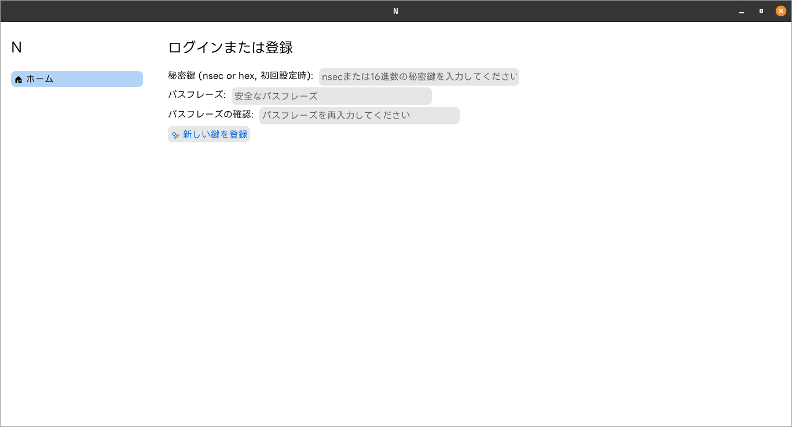
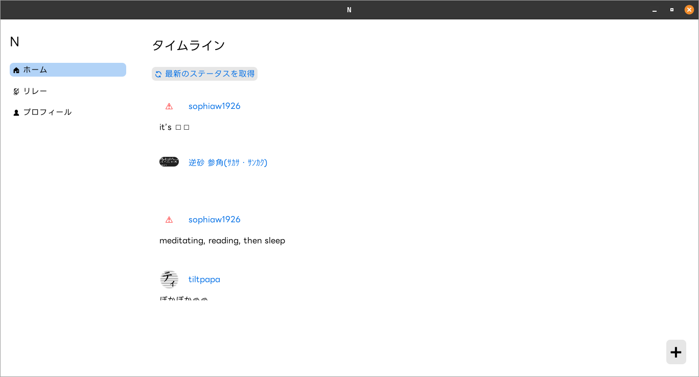
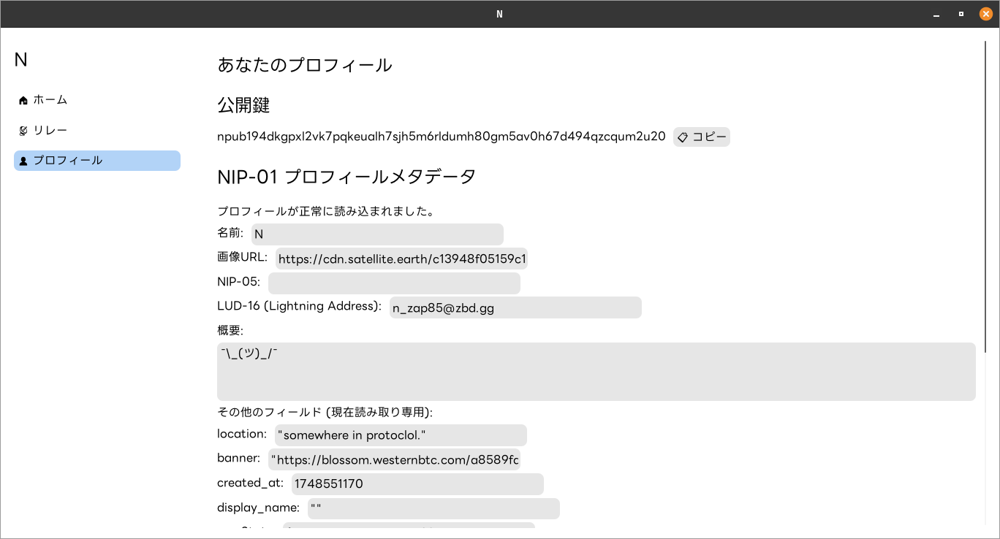

# N

[日本語](#n) | [English](#n-1)

**会話をなくし、シンプルなステータス共有を実現するNostrアプリケーション**

## 概要

現代のSNSは会話が中心となり、望まない会話を目にすることも少なくありません。
このアプリケーションは、Twitterの原点であるシンプルな「ステータス共有」に回帰するために作成されました。
NIP-38を利用してあなたのステータスを投稿するための、シンプルなGUIアプリケーションです。
ログはサイドパネルではなく、ターミナルに表示されます。

## スクリーンショット






## 特徴

*   **洗練されたUI:** LINE Seed JPフォントを採用し、モダンなmacOS風のデザインで、直感的な操作が可能です。
*   **ステータス投稿 (NIP-38):** あなたの現在の状況を簡単に投稿できます。
*   **プロフィールの表示と編集 (NIP-01):** Nostrのプロフィール情報を表示し、編集することができます。
*   **安全な鍵管理 (NIP-49):** 秘密鍵はパスフレーズで暗号化（ChaCha20Poly1305）され、ローカルに保存されます。起動時にパスフレーズの入力が求められます。
*   **自動的なリレー接続とステータス取得:** ログイン時にあなたのリレーリスト（NIP-65）に自動で接続し、フォローしているユーザーのリスト（NIP-02）と最新のステータス（NIP-38）を取得して表示します。
*   **高度なリレーリスト管理 (NIP-65):** アプリから直接リレーリストを閲覧、編集、公開できます。リレーの追加や削除、読み書きの権限設定が可能です。さらに、フォローしているユーザーのリレーリストをインポートする機能もあります。
*   **タブ形式のインターフェース:** ホーム（タイムラインと投稿）、リレー、プロフィールのタブで簡単に機能を切り替えられます。
*   **パフォーマンス:** プロフィール情報やリレーリストなどをキャッシュすることで、次回の起動を高速化します。
*   **会話機能の排除:** このツールはステータス投稿専用です。リプライやメンションなどの会話機能はありません。

## 技術スタック

*   [rust-nostr](https://docs.rs/nostr/latest/nostr/index.html)
*   [eframe](https://github.com/emilk/egui/tree/master/crates/eframe)
*   [egui](https://github.com/emilk/egui)

## インストール & 使い方

1.  **リポジトリをクローンし、ディレクトリに移動します:**
    ```bash
    git clone https://github.com/tami1A84/N.git
    cd N
    ```
2.  **アプリケーションを実行します:**
    ```bash
    cargo run
    ```
3.  **GUIウィンドウが開きます。画面の指示に従って、初回設定とステータス投稿を行ってください。**

    > **リレーに関する注記 (NIP-65):**
    > もしあなたがNIP-65でリレーリストを公開している場合、アプリケーションは自動的にそのリレーを使用します。公開していない場合は、デフォルトのリレーに接続されます。

---

# N

[日本語](#n) | [English](#n-1)

**Nostr a simple status sharing application to eliminate conversation.**

## Abstract

In today's social networking services, the focus is on conversation, and it is not uncommon to see conversations that are not desired.
This application was created to bring back the simple "status sharing" of the early days of Twitter, rather than the conversational aspect of Twitter.
This application is a simple GUI application that allows you to post your status using NIP-38.
Logs are displayed in the terminal, not in the side panel.

## Screenshot


## Features

*   **Sophisticated UI:** A modern, macOS-inspired design with the LINE Seed JP font for intuitive operation.
*   **Post Status Updates (NIP-38):** Easily post your current status.
*   **Profile Display and Editing (NIP-01):** View and edit your Nostr profile information.
*   **Secure Key Management (NIP-49):** Your secret key is encrypted (ChaCha20Poly1305) with a passphrase and stored locally. You will be prompted for the passphrase at startup.
*   **Automatic Relay Connection and Status Retrieval:** On login, the application automatically connects to your relay list (NIP-65), retrieves your follow list (NIP-02), and displays the latest statuses (NIP-38).
*   **Advanced Relay List Management (NIP-65):** View, edit, and publish your relay list directly from the app. You can add or remove relays, set read/write preferences, and even import relay lists from users you follow.
*   **Tabbed Interface:** Easily switch between functions with tabs for Home (Timeline & Posting), Relays, and Profile.
*   **Performance:** Caches profile information and relay lists to speed up subsequent launches.
*   **No Conversation Features:** This tool is for posting statuses only. There are no replies, mentions, or other conversational features.

## Technical Stacks

*   [rust-nostr](https://docs.rs/nostr/latest/nostr/index.html)
*   [eframe](https://github.com/emilk/egui/tree/master/crates/eframe)
*   [egui](https://github.com/emilk/egui)

## Installation & Usage

1.  **Clone the repository and navigate to the directory:**
    ```bash
    git clone https://github.com/tami1A84/N.git
    cd N
    ```
2.  **Run the application:**
    ```bash
    cargo run
    ```
3.  **The GUI window will open. Follow the on-screen instructions for setup and status posting.**

    > **Note on Relays (NIP-65):**
    > If you have published a relay list with NIP-65, the application will automatically use those relays for posting. If not, it will connect to default relays.
